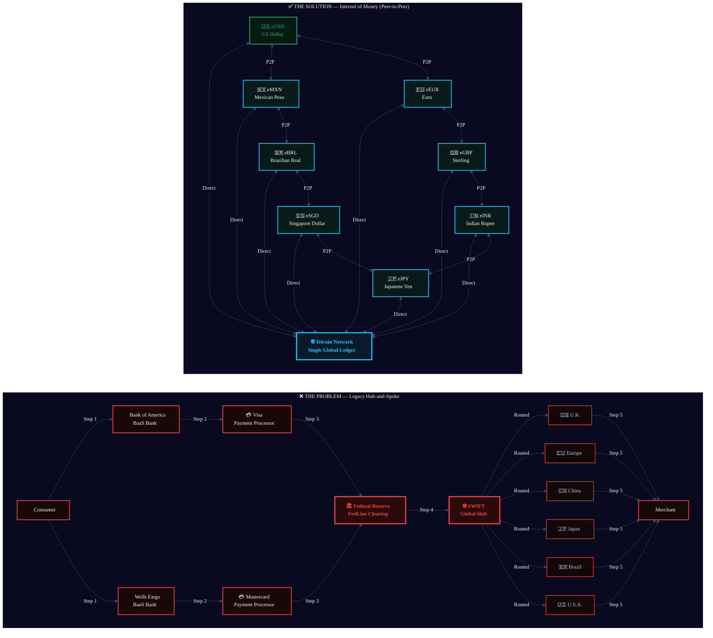
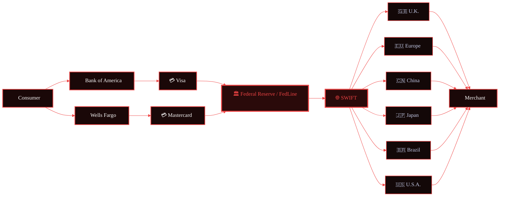
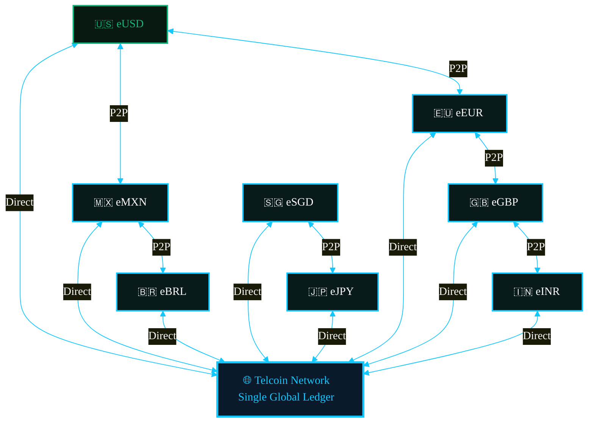

# FigJam / Mermaid — Internet of Money Comparison Spec

**File**: `figma-internet-of-money-comparison.md`
**Purpose**: Side-by-side flowchart for FigJam import or Mermaid rendering — Legacy SWIFT hub-and-spoke (The Problem) vs. Internet of Money peer-to-peer network (The Solution).
**Brand reference**: `strategy/BRAND-GUIDE.md`
**Last updated**: 2026-03-18

---

## Rendering Instructions

This spec uses Mermaid `flowchart LR` syntax with `classDef` for brand color treatment.
Paste into any Mermaid-compatible renderer (FigJam, Notion, mermaid.live, VS Code extension).

For FigJam: use the Mermaid plugin → paste the block below → export as SVG or PNG at 2x.

---

## Mermaid Diagram — Full Comparison

---

## Key Design Notes for FigJam

**Colors used:**

| Token | Hex | Application |
|---|---|---|
| TEL Black | `#090920` | Canvas background |
| Tel Royal Blue | `#3642B2` | Subgraph borders, primary brand anchors |
| TEL Blue | `#14C8FF` | Solution nodes, connection lines |
| Problem Red | `#EF4444` | Problem nodes, hub nodes, error indicators |
| Solution Green | `#10B981` | eUSD node (Telcoin Digital Asset Bank) |
| Body text | `#C9CFED` | Node labels |
| Muted text | `#424761` | Supporting captions |

**Layout guidance for FigJam manual arrangement:**

After importing via Mermaid plugin:

1. Place the PROBLEM subgraph on the left, SOLUTION subgraph on the right
2. Add a vertical divider bar (`#3642B2`, 2px, full height) between the two halves
3. Add text label at top: "THE PROBLEM" in `#EF4444` / "THE SOLUTION" in `#14C8FF`
4. SWIFT node should be visually largest on the left — apply red outer glow in FigJam
5. Telcoin Network globe should be visually largest on the right — apply TEL Blue outer glow
6. Add frame: 1920 x 1080px, background `#090920`
7. Add hexagon pattern overlay at 4% opacity (brand motif)

**Callout annotations to add manually in FigJam:**

Left side (PROBLEM):
- Sticky note (red): "5-7 intermediaries per cross-border transaction"
- Sticky note (red): "Built on legacy COBOL infrastructure"
- Sticky note (red): "WSJ, Dec 25 2024: 'infrastructure not fit for purpose'"

Right side (SOLUTION):
- Sticky note (green): "Direct peer-to-peer settlement on-chain"
- Sticky note (blue): "Bank-issued stablecoins — regulated, chartered"
- Sticky note (blue): "Rep. Glenn Thompson, Feb 4 2025: 'Internet of value'"

---

## Standalone Left-Side Mermaid (Problem Only)

For use in isolation — presentations, reports, standalone export.

---

## Standalone Right-Side Mermaid (Solution Only)

For use in isolation — presentations, reports, standalone export.

---

## Source References

- Slide content: Telcoin Association investor/stakeholder deck, Slides 3-4
- Research file: `campaign/research/TELCOIN-RESEARCH.md`
- Brand colors: `strategy/BRAND-GUIDE.md`
- WSJ quote: Wall Street Journal, Dec 25 2024
- Thompson quote: U.S. Representative Glenn Thompson, Feb 4 2025
- HTML infographics: `campaign/execution/2026-03-18/infographic-problem-legacy-banking.html` and `infographic-solution-internet-of-money.html`
