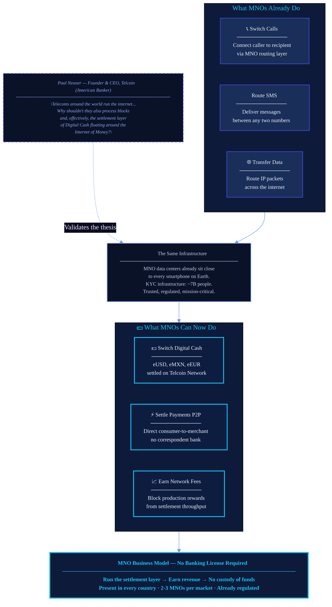
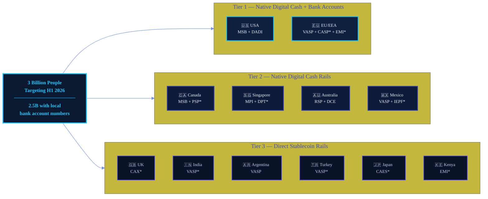

# FigJam Mermaid Spec — MNO Opportunity Flowchart
## Telcoin Association — Mobile Financial Services 2.0
### Source: MNO Deck Slides 8–9
### Generated: 2026-03-18

---

## Usage

Paste the Mermaid block below directly into a FigJam diagram node.
To do this in FigJam: Insert > Diagram > Mermaid, then paste the code.

---

## Mermaid Flowchart

---

## Diagram Notes for FigJam Production

### Layout guidance
- The `TODAY` cluster should read left-to-right on a single row.
- The `TOMORROW` cluster mirrors it directly below.
- The `ANALOGY` bridge node sits between them as the visual pivot.
- The `QUOTE` node floats to the right of `ANALOGY`, connected with a dashed line.
- The `OUTCOME` node anchors the bottom as the result state.

### Color application in Figma post-processing
After importing the Mermaid output, apply these manual overrides in FigJam for full brand compliance:

| Element | Fill | Border | Text |
|---|---|---|---|
| TODAY subgraph background | `#0D1A3A` | `#3642B2` (1.5px) | `#F1F4FF` |
| TOMORROW subgraph background | `#071020` | `#14C8FF` (2px) | `#F1F4FF` |
| CALLS / SMS / DATA nodes | `#192E58` | `#3642B2` | `#F1F4FF` |
| CASH / PAYMENTS / REVENUE nodes | `#0A1830` | `#14C8FF` | `#F1F4FF` |
| ANALOGY bridge | `#0A1228` | `#7393EA` (dashed 4px) | `#C9CFED` |
| QUOTE node | `#0A1228` | `#524CF8` (dashed) | `#9aabf0` |
| OUTCOME node | `#0D1A3A` | `#14C8FF` (2.5px) | `#14C8FF` |
| Flow arrows | `#7393EA` | — | — |
| Dashed quote arrow | `#524CF8` | — | — |

### Typography
- Node titles: Inter Bold, 14px
- Node body: Inter Regular, 12px
- Subgraph labels: Inter SemiBold, 13px, uppercase, letter-spacing 0.1em

### Usage context
This diagram is intended for:
- Internal MNO pitch decks (Slide 8 companion)
- Agency visual briefings
- Partner onboarding materials

Not intended for direct social media publication without redesign in Figma.

---

## Extended Version — Market Expansion Layer

Add this second flowchart below the first in the same FigJam board to show the market footprint.

### Abbreviation key for market expansion diagram
| Abbr | Full name |
|---|---|
| MSB | Money Services Business |
| DADI | Digital Asset Depository Institution |
| VASP | Virtual Asset Service Provider |
| CASP | Crypto Asset Service Provider |
| EMI | E-money Institution |
| PSP | Payment Service Provider |
| MPI | Major Payment Institution |
| DPT | Digital Payment Tokens |
| RSP | Remittance Service Provider |
| DCE | Digital Currency Exchange |
| IEPF | Institution of Electronic Payment Funds |
| CAX | Crypto Asset Exchange |
| CAES | Crypto-asset Exchange Service |
| * | Application in preparation or processing |

---

*This spec was produced for the Telcoin Association Marketing Agency. For production questions, refer to `design/DESIGN-TEAM.md`.*
